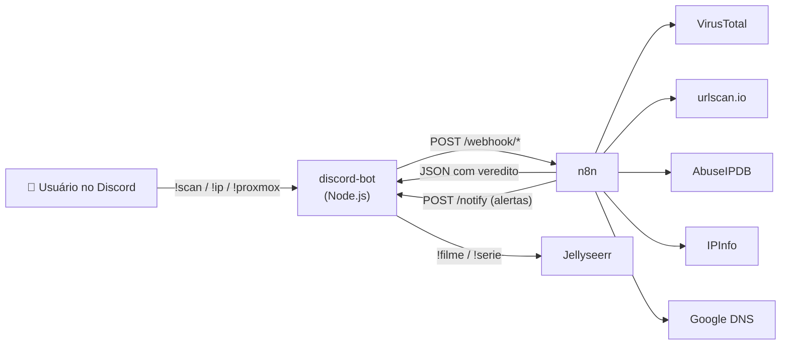

# 🤖 Automações — Segurança & Homelab

Automações que rodam no meu homelab. Um **bot de Discord** serve de painel de comando, e os **workflows no n8n** fazem o trabalho pesado: consultam APIs de threat intelligence, juntam os resultados e devolvem um veredito pronto pra ler no chat.

```
!scan https://site-suspeito.com   → phishing ou não? (VirusTotal + urlscan.io)
!ip 185.220.101.1                 → reputação, geolocalização, ASN e DNS reverso
!proxmox                          → status e controle das VMs/containers
!filme duna                       → pedido de mídia via Jellyseerr
```

## Arquitetura



O bot não tem lógica de análise: ele valida a entrada, chama o webhook certo do n8n e formata a resposta. Dá pra trocar a interface (Telegram, Slack, CLI) sem mexer nos workflows, e dá pra chamar os workflows direto via HTTP, sem o bot.

## Automações

| Automação | O que faz | Pasta |
|---|---|---|
| 🔎 **URL Reputation Scanner** | Envia a URL pro VirusTotal e pro urlscan.io, espera as análises, combina os resultados e classifica como `SAFE` / `SUSPICIOUS` / `PHISHING`. URLs perigosas voltam *defanged* (`hxxps://site[.]com`). | [`n8n-workflows/url-reputation-scanner`](n8n-workflows/url-reputation-scanner) |
| 🌐 **IP Intelligence Pipeline** | Consulta 4 fontes em paralelo (VirusTotal, AbuseIPDB, IPInfo, DNS reverso) e calcula um risk score de 0 a 100. Se uma fonte cai, o relatório sai assim mesmo e mostra qual fonte falhou. | [`n8n-workflows/ip-intelligence`](n8n-workflows/ip-intelligence) |
| 🤖 **Discord Bot** | Interface de comandos + endpoint `/notify` autenticado pro n8n mandar alertas no Discord. | [`discord-bot`](discord-bot) |

## Estrutura

```
.
├── discord-bot/                  # bot Node.js (discord.js + axios)
│   ├── bot.js
│   └── .env.example
└── n8n-workflows/
    ├── url-reputation-scanner/   # workflow.json + documentação
    └── ip-intelligence/          # workflow.json + documentação
```

## Rodando

1. **n8n**: importe os `workflow.json` (menu `...` → *Import from File*), crie as credenciais listadas no README de cada workflow e ative.
2. **Bot**: veja [`discord-bot/README.md`](discord-bot/README.md).

## Segurança

- **Nenhuma chave neste repositório.** As chaves de API ficam nas *Credentials* do n8n, e o token do bot fica no `.env` (modelo em [`.env.example`](discord-bot/.env.example)).
- O endpoint `/notify` exige o header `X-Notify-Key`, comparado em tempo constante (`crypto.timingSafeEqual`), e envia as mensagens com `allowedMentions: { parse: [] }`, então nunca dispara `@everyone`.
- Cada comando só funciona no canal configurado pra ele.

## Stack

`n8n` · `Node.js` · `discord.js v14` · `axios` · APIs: VirusTotal v3, urlscan.io, AbuseIPDB v2, IPInfo, Google Public DNS
