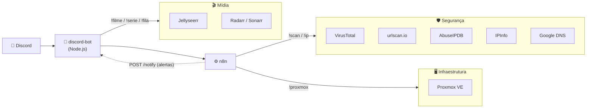

# 🏠 Homelab Automations

Um sistema de automação pro meu homelab, controlado pelo Discord. Ele cobre três frentes: **segurança**, **infraestrutura** e **mídia**.

Os temas são só uma forma de organizar. Por baixo é **um sistema só**: um bot de Discord como ponto de entrada, um n8n fazendo o trabalho pesado e um `.env` com a configuração.

| | Tema | O que resolve | Comandos |
|---|---|---|---|
| 🛡️ | [**Segurança**](#️-segurança) | Triagem de URLs e IPs suspeitos direto do chat | `!scan` `!ip` |
| 🖥️ | [**Infraestrutura**](#️-infraestrutura) | Status e controle do servidor Proxmox, alertas do homelab | `!proxmox` · `POST /notify` |
| 🎬 | [**Mídia**](#-mídia) | Pedidos de filmes e séries pro stack *arr + Jellyfin | `!filme` `!serie` `!fila` `!cancelar` `!novidades` |

## Arquitetura



O bot não tem lógica de análise: ele valida o comando, chama o serviço certo e formata a resposta. Segurança e infraestrutura passam pelos workflows do n8n. A mídia fala direto com o Jellyseerr e o Radarr/Sonarr, porque depende de menus e botões interativos do Discord.

---

## 🛡️ Segurança

Triagem de indicadores (URLs e IPs) sem sair do chat: você cola o suspeito e recebe um veredito, com o que cada fonte disse.

```
!scan https://site-suspeito.com   → SAFE / SUSPICIOUS / PHISHING (VirusTotal + urlscan.io)
!ip 185.220.101.1                 → risk score 0–100, reputação, geolocalização, ASN e DNS reverso
```

| Automação | Destaques | Pasta |
|---|---|---|
| 🔎 **URL Reputation Scanner** | Combina VirusTotal e urlscan.io num veredito único. URLs perigosas voltam *defanged* (`hxxps://site[.]com`) pra ninguém clicar sem querer. Consulta o VirusTotal até 5 vezes se a análise demorar. | [`n8n-workflows/url-reputation-scanner`](n8n-workflows/url-reputation-scanner) |
| 🌐 **IP Intelligence Pipeline** | 4 fontes em paralelo (VirusTotal, AbuseIPDB, IPInfo, DNS reverso). Se uma fonte cai, o relatório sai assim mesmo e mostra qual falhou. | [`n8n-workflows/ip-intelligence`](n8n-workflows/ip-intelligence) |

## 🖥️ Infraestrutura

Visão e controle do servidor pelo Discord, e um canal de alertas que qualquer automação do homelab pode usar.

```
!proxmox                  → CPU, RAM, VMs, containers e storage
!proxmox restart 103      → reinicia uma VM ou container pelo ID
```

| Automação | Destaques | Pasta |
|---|---|---|
| 📊 **Proxmox Dashboard** | Relatório do host e start/stop/restart pelo ID, sem precisar dizer se é VM ou container. O `stop` desliga pelo sistema operacional, e o token de API tem só 4 permissões. | [`n8n-workflows/proxmox-dashboard`](n8n-workflows/proxmox-dashboard) |
| 🚨 **Alertas (`/notify`)** | Endpoint HTTP autenticado no bot. O n8n, ou qualquer script do homelab, posta alertas no Discord sem precisar do token do bot. | [`discord-bot`](discord-bot#endpoint-de-alertas-post-notify) |

## 🎬 Mídia

Pedidos de filmes e séries pro stack de mídia (Jellyseerr, Radarr, Sonarr, qBittorrent e Jellyfin), com menus e botões nativos do Discord.

```
!serie breaking bad   → escolhe o título no menu → escolhe as temporadas → confirma no botão
!fila                 → o que está baixando, com % e tempo restante
!cancelar             → remove o torrent, desmonitora e apaga o pedido
```

| Automação | Destaques | Pasta |
|---|---|---|
| 🍿 **Pedidos de mídia** | Fluxo interativo (busca → escolha → temporadas → confirmação) que só quem pediu pode usar. O cancelamento vai de ponta a ponta, pra o Radarr/Sonarr não baixar de novo. | [`discord-bot`](discord-bot#pedidos-de-mídia-mediajs) (`media.js`) |

---

## Estrutura

```
.
├── discord-bot/                  # 🤖 ponto de entrada único (um processo, um .env)
│   ├── bot.js                    #    🛡️ !scan !ip · 🖥️ !proxmox e /notify
│   ├── media.js                  #    🎬 !filme !serie !fila !cancelar !novidades
│   ├── package.json
│   ├── package-lock.json
│   └── .env.example
└── n8n-workflows/
    ├── url-reputation-scanner/   # 🛡️
    ├── ip-intelligence/          # 🛡️
    └── proxmox-dashboard/        # 🖥️
```

Cada pasta de workflow tem o `workflow.json` pra importar no n8n e um README com o fluxo, o formato da resposta e as credenciais necessárias.

## Rodando

1. **n8n**: importe os `workflow.json` (menu `...` → *Import from File*), crie as credenciais listadas no README de cada workflow e ative.
2. **Bot**: veja [`discord-bot/README.md`](discord-bot/README.md).

Dá pra usar só uma parte: sem as chaves do Jellyseerr, os comandos de mídia só avisam que falta configuração, e um workflow que não foi importado só afeta o comando dele.

## 🔐 Cuidados de segurança do projeto

- **Nenhuma chave neste repositório.** As chaves de API ficam nas *Credentials* do n8n, e os tokens do bot ficam no `.env` (modelo em [`.env.example`](discord-bot/.env.example)).
- O endpoint `/notify` exige o header `X-Notify-Key`, comparado em tempo constante (`crypto.timingSafeEqual`), e envia as mensagens com `allowedMentions: { parse: [] }`, então nunca dispara `@everyone`.
- Cada comando só funciona no canal configurado pra ele. Na mídia, só admins cancelam downloads, e sem ninguém configurado os comandos ficam bloqueados.
- O token do Proxmox usa um papel com só 4 permissões (leitura + liga/desliga). O passo a passo está no [README do workflow](n8n-workflows/proxmox-dashboard).
- Dependências fixadas no `package-lock.json` e verificadas com `npm audit`.

## Stack

| | |
|---|---|
| **Base** | n8n · Node.js · discord.js v14 · axios |
| 🛡️ **Segurança** | VirusTotal v3 · urlscan.io · AbuseIPDB v2 · IPInfo · Google Public DNS |
| 🖥️ **Infraestrutura** | Proxmox VE API |
| 🎬 **Mídia** | Jellyseerr · Radarr v3 · Sonarr v3 |
