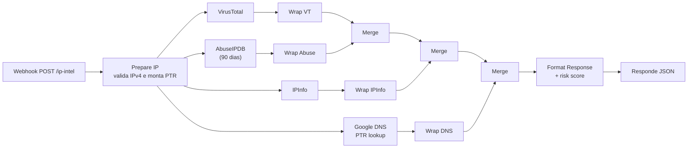

# 🌐 IP Intelligence Pipeline

Recebe um IPv4, consulta **4 fontes em paralelo** e devolve um relatório consolidado com reputação, geolocalização, rede e um risk score de 0 a 100.

## Fluxo



Detalhes:

- **Paralelismo**: as 4 consultas saem ao mesmo tempo, então o tempo total fica perto do da fonte mais lenta, e não da soma de todas.
- **Tolerância a falhas**: cada request usa `continueOnFail`, e o nó *Wrap* seguinte converte erro em `null` + flag. Se o AbuseIPDB estourar o rate limit, por exemplo, o relatório sai com as outras 3 fontes e o campo `sources` mostra o que falhou.
- **DNS reverso**: usa o `hostname` do IPInfo. Se não vier, faz a consulta PTR em `x.x.x.x.in-addr.arpa` via Google Public DNS.

## Risk score

```
score = min(100, VT_malicious × 20 + VT_suspicious × 10 + AbuseIPDB_confidence)
```

| Score | Nível |
|---|---|
| `≥ 70` | `High` |
| `30 – 69` | `Medium` |
| `< 30` | `Low` |

## API

**Request**

```bash
curl -X POST http://localhost:5678/webhook/ip-intel \
  -H "Content-Type: application/json" \
  -d '{"ip": "8.8.8.8"}'
```

**Response** (resumida, valores ilustrativos)

```json
{
  "ip": "8.8.8.8",
  "country": "US",
  "region": "California",
  "city": "Mountain View",
  "timezone": "America/Los_Angeles",
  "asn": "AS15169",
  "org": "Google LLC",
  "reverse_dns": "dns.google",
  "location": { "lat": 37.4056, "lon": -122.0775 },
  "risk": { "score": 0, "level": "Low" },
  "reputation": {
    "virustotal": { "malicious": 0, "suspicious": 0, "harmless": 62, "reputation": 545 },
    "abuseipdb":  { "abuseConfidenceScore": 0, "totalReports": 12, "isWhitelisted": true }
  },
  "network": { "isp": "Google LLC", "domain": "google.com", "asn": "AS15169" },
  "sources": { "virustotal": true, "abuseipdb": true, "ipinfo": true, "dns": true }
}
```

## Credenciais (n8n)

Crie as três como **Header Auth** e selecione nos nós HTTP depois de importar:

| Nome no n8n | Header | Valor | Chave em |
|---|---|---|---|
| `VirusTotal` | `x-apikey` | sua API key | [virustotal.com](https://www.virustotal.com/gui/my-apikey) |
| `AbuseIPDB` | `Key` | sua API key | [abuseipdb.com/account/api](https://www.abuseipdb.com/account/api) |
| `IPInfo` | `Authorization` | `Bearer <token>` | [ipinfo.io/account/token](https://ipinfo.io/account/token) |

O DNS reverso usa o Google Public DNS, que não precisa de chave.
