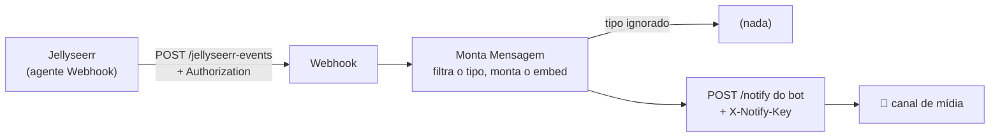

# 🎬 Media Notifications (Jellyseerr → Discord)

Fecha o ciclo dos pedidos de mídia. Quando o filme ou a série fica disponível, o Jellyseerr avisa o n8n, e o n8n posta no canal de mídia do Discord **marcando quem pediu**.

```
!serie breaking bad  →  pedido  →  download (Sonarr/qBittorrent)  →  ✅ @você seu pedido chegou! 🍿
```

## Fluxo



| Evento do Jellyseerr | Mensagem no Discord |
|---|---|
| `MEDIA_AVAILABLE` (disponível) | `✅ Chegou: Duna (2021)`: pôster, sinopse, temporadas e quem pediu, **com menção** a essa pessoa |
| `MEDIA_FAILED` (falha no download) | `❌ Falhou o download de: ...`, sem menção |
| `TEST_NOTIFICATION` (botão *Test*) | `🧪 Teste do Jellyseerr: a integração está funcionando` |
| qualquer outro | ignorado (o bot já confirma o pedido na hora) |

Detalhes:

- **A menção é controlada pelo bot.** O `/notify` só pinga os IDs que vêm em `mentionUsers`, e só IDs válidos do Discord. `@everyone` e cargos nunca são pingados.
- **Funciona em qualquer versão do Jellyseerr.** O campo com o ID do Discord de quem pediu se chama `discordId` até a v3.2 e `discordIds` da v3.3 em diante. O workflow lê os dois e descarta variável que chegou sem ser substituída (`{{...}}`).
- **O webhook exige senha.** Sem o header `Authorization` certo, o n8n responde `403` e nada é postado.

## Configuração

### 1. n8n

Importe o `workflow.json` e crie duas credenciais **Header Auth**:

| Nome no n8n | Header | Valor |
|---|---|---|
| `Jellyseerr Webhook` | `Authorization` | uma senha qualquer (gere com `openssl rand -hex 32`) |
| `Discord Bot (/notify)` | `X-Notify-Key` | a mesma `NOTIFY_KEY` do `.env` do bot |

No nó **Monta Mensagem**, ajuste `BOT_URL` se o bot não estiver em `http://localhost:3001`. Se o n8n roda em Docker e o bot no host, `localhost` aponta pro próprio container: use o IP da máquina na rede (ex.: `http://192.168.x.x:3001`) ou `http://host.docker.internal:3001`.

Ative o workflow.

### 2. Bot

Confira se o `.env` tem `NOTIFY_KEY` e `MEDIA_CHANNEL`. Os avisos vão pro `MEDIA_CHANNEL`; sem ele, vão pro canal de alertas.

### 3. Jellyseerr

Em **Settings → Notifications → Webhook**:

| Campo | Valor |
|---|---|
| Enable Agent | ✅ |
| Webhook URL | `http://<host-do-n8n>:5678/webhook/jellyseerr-events` |
| Authorization Header | a mesma senha da credencial `Jellyseerr Webhook` |
| Notification Types | **Request Available** e **Request Processing Failed** |
| JSON Payload | o modelo abaixo |

```json
{
  "notification_type": "{{notification_type}}",
  "subject": "{{subject}}",
  "message": "{{message}}",
  "image": "{{image}}",
  "{{request}}": {
    "requestedBy_username": "{{requestedBy_username}}",
    "requestedBy_settings_discordId": "{{requestedBy_settings_discordId}}",
    "requestedBy_settings_discordIds": "{{requestedBy_settings_discordIds}}"
  },
  "{{extra}}": []
}
```

> O modelo padrão do Jellyseerr também funciona, mas nas versões 3.3+ ele manda o ID do Discord num campo antigo que não é mais preenchido, e o aviso sai sem menção. Com o modelo acima, a menção funciona em qualquer versão.

Clique em **Test**: a mensagem `🧪 Teste do Jellyseerr` deve aparecer no canal de mídia.

### 4. Menção de quem pediu

Cada pessoa informa o próprio ID do Discord no Jellyseerr: **perfil → Settings → Notifications → Discord User ID**. Sem isso, o aviso sai normalmente, só que sem menção.
