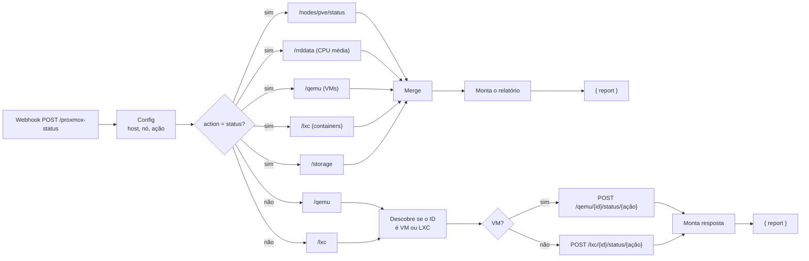

# 📊 Proxmox Status Dashboard

Duas funções no mesmo webhook: gerar um **dashboard do host Proxmox** (CPU, RAM, VMs, containers e storage) em texto pronto pro Discord, e **ligar, desligar ou reiniciar** uma VM ou container pelo ID.

## Fluxo



Detalhes:

- **5 consultas em paralelo** no modo dashboard. Se uma falhar, só o bloco dela aparece como `❌ Dados indisponíveis` e o resto do relatório sai normalmente.
- **CPU pela média dos últimos 5 minutos** (`rrddata`), que oscila bem menos que a leitura instantânea. Sem esses dados, cai pra leitura instantânea do `/status`.
- **O usuário só informa o ID** (`!proxmox restart 103`). O workflow descobre sozinho se é VM (`qemu`) ou container (`lxc`) e chama a rota certa.
- A resposta é sempre `{ "report": "..." }` já formatado em Markdown do Discord, então o bot só repassa o texto.

## Exemplo de relatório (valores ilustrativos)

```
🗓️ Proxmox Dashboard — 29/09/2026, 14:32:10

🖥️ Host Status
> 🟢 CPU: ██░░░░░░░░ 18% (5min)
> 🟠 RAM: ███████░░░ 68% (21.6/31.2 GB)
> ⏱️ Uptime: 12d 4h 31m | Load: 0.52 / 0.61 / 0.58

🖥️ VMs (1/2 running)
> 🟢 100 home-assistant — running | RAM: 1843/4096 MB
> 🔴 101 windows-lab — stopped

📦 LXC Containers (2/2 running)
> 🟢 103 n8n — running | RAM: 612/2048 MB
> 🟢 104 jellyfin — running | RAM: 1320/4096 MB

💾 Storage
> 🟢 local (dir): ███░░░░░░░ 31% — 29.1/94.3 GB
> 🟠 local-lvm (lvmthin): ███████░░░ 72% — 250.4/348.8 GB
```

## Ações

| Comando no bot | Rota no Proxmox | Efeito |
|---|---|---|
| `!proxmox start <id>` | `status/start` | Liga |
| `!proxmox stop <id>` | `status/stop` | Desligamento **imediato**, como tirar da tomada |
| `!proxmox restart <id>` | `status/reboot` | Reinicia pelo sistema operacional |

## Configuração

1. No nó **Config**, ajuste `PROXMOX_HOST` (ex.: `https://192.168.1.10:8006`) e `NODE_NAME` (padrão `pve`).
2. Crie a credencial **Header Auth** chamada `Proxmox`:

   | Header | Valor |
   |---|---|
   | `Authorization` | `PVEAPIToken=<usuário>@<realm>!<token-id>=<secret>` |

### Token com o mínimo de permissão

O workflow só precisa ler status e ligar/desligar máquinas, então não use o `root`. No shell do Proxmox:

```bash
pveum role add N8nDashboard --privs "Sys.Audit VM.Audit Datastore.Audit VM.PowerMgmt"
pveum user add n8n@pve
pveum acl modify / --users n8n@pve --roles N8nDashboard
pveum user token add n8n@pve dashboard --privsep 0
```

O último comando mostra o secret uma única vez. O valor do header fica `PVEAPIToken=n8n@pve!dashboard=<secret>`.

| Permissão | Pra quê |
|---|---|
| `Sys.Audit` | Status do host e histórico de CPU |
| `VM.Audit` | Listar VMs e containers |
| `Datastore.Audit` | Listar storages |
| `VM.PowerMgmt` | start / stop / reboot |

### Certificado

O Proxmox vem com certificado autoassinado, então os nós HTTP estão com **Ignore SSL Issues** (`allowUnauthorizedCerts`) ativado. Numa rede interna isolada isso é aceitável. O ideal é emitir um certificado válido (o Proxmox tem ACME embutido, em *Datacenter → ACME*) e desativar essa opção.
