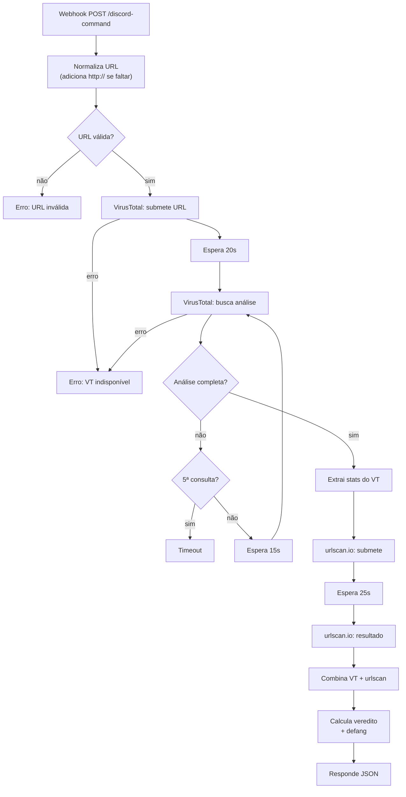

# 🔎 URL Reputation Scanner (VirusTotal + urlscan.io)

Recebe uma URL, submete pra análise em dois serviços, espera os resultados e devolve um veredito: `SAFE`, `SUSPICIOUS` ou `PHISHING`.

## Fluxo



Detalhes:

- **Polling com limite**: o VirusTotal nem sempre termina a análise na primeira consulta. O workflow consulta de novo a cada 15s, até 5 consultas no total, e depois desiste com uma resposta de timeout.
- **urlscan.io é opcional**: esses nós usam `continueOnFail`. Se o urlscan cair, o veredito sai só com o VirusTotal e a resposta indica `urlscan.available: false`.
- **Defang**: se o veredito não for `SAFE`, a URL volta como `hxxps://site[.]com`, pra ninguém clicar sem querer no Discord.

## Regra do veredito

| Condição (avaliada de cima pra baixo) | Risco | Veredito |
|---|---|---|
| VT `malicious ≥ 1` **ou** urlscan marcou como malicioso | `High` | `PHISHING` |
| VT `suspicious ≥ 2` **ou** score do urlscan `≥ 50` | `Medium` | `SUSPICIOUS` |
| VT `suspicious ≥ 1` | `Low-Medium` | `SUSPICIOUS` |
| nenhuma das anteriores | `Low` | `SAFE` |

## API

**Request**

```bash
curl -X POST http://localhost:5678/webhook/discord-command \
  -H "Content-Type: application/json" \
  -d '{"url": "https://exemplo.com/login"}'
```

**Response** (valores ilustrativos)

```json
{
  "url": "hxxps://exemplo[.]com/login",
  "original_url": "https://exemplo.com/login",
  "verdict": "PHISHING",
  "risk_level": "High",
  "timestamp": "2026-09-29T15:04:05.000Z",
  "screenshot": "https://urlscan.io/screenshots/<uuid>.png",
  "engines": {
    "virustotal": { "malicious": 7, "suspicious": 1, "harmless": 55 },
    "urlscan":    { "malicious": true, "score": 100, "available": true }
  }
}
```

A análise inteira leva uns 50 segundos (20s de espera no VirusTotal e 25s no urlscan), então quem chama precisa de um timeout de pelo menos 60s.

## Credenciais (n8n)

Crie as duas como **Header Auth** e selecione nos nós HTTP depois de importar:

| Nome no n8n | Header | Valor | Chave em |
|---|---|---|---|
| `VirusTotal` | `x-apikey` | sua API key | [virustotal.com](https://www.virustotal.com/gui/my-apikey) |
| `urlscan.io` | `API-Key` | sua API key | [urlscan.io/user/profile](https://urlscan.io/user/profile/) |

> Os scans são enviados ao urlscan.io com `visibility: public`, ou seja, ficam visíveis pra qualquer um no site. Pra URLs internas ou sensíveis, troque para `unlisted` ou `private` no nó *URLScan.io - Submit URL*.
